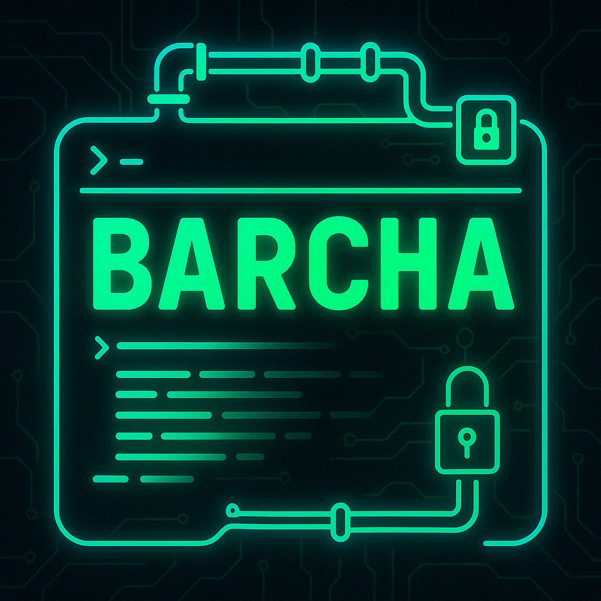
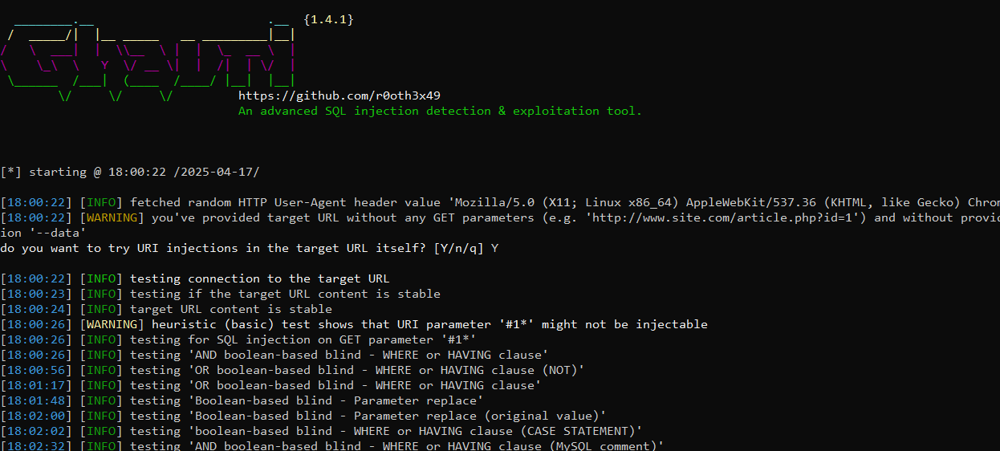

<p align="center">
  <!-- Include this image in your repo (e.g. banner.png in the root) -->
  
</p>

# 🚀 Barcha

[](https://pkg.go.dev/github.com/youruser/barcha)  
[](LICENSE)

**Barcha** is your Swiss‑Army knife for SQL Injection reconnaissance 🔍. Written in Go, it automates:

- **Shodan enumeration** of SSL hosts 🕵️‍♂️  
- **Liveness & redirect checks** (ignores bad certs) 🔄  
- **Automated Ghauri tests** for each host 🛡️  
- **SQLite logging** of every scan 🔖  

---

## 🌟 Features

- 📡 **Shodan Dork**: hostname:"*.example.com" -403 -503 -http.title:"Invalid URL" -302 -404


- 🖧 **Reverse DNS**: IP → hostname, skips `amazonaws` NAT addresses  
- 🔀 **Redirect Handling**: Follows HTTP ↔ HTTPS transparently  
- 🔐 **TLS Flexibility**: Ignores expired/self‑signed certs  
- 🛠️ **Ghauri Integration**: ghauri -u <URL> --random-agent --confirm --force-ssl --level=3 --dbs --dump --batch


- 📊 **History**: Logs into `barcha_history.db`  

📸 Screenshots
<p align="center"> <br> <em>Figure 1. Per‑host SQLi testing via Ghauri. </em> </p> <p align="center"> <br> <em>Figure 2. Live host detection & redirect checks.</em> </p>

## 📋 Requirements

- Go **1.18+**  
- [Ghauri](https://github.com/r0oth3x49/ghauri) installed & on `PATH`  
- A Shodan API key in `SHODAN_API_KEY`  


## ⚡ Installation
```bash
go install github.com/S1N6H/Barcha@latest
```


🏃 Usage
Export your Shodan key

export SHODAN_API_KEY="YOUR_SHODAN_API_KEY"
Run Barcha

./barcha

Enter your target domain when prompted (e.g. example.com)

Watch it go! 🎉

